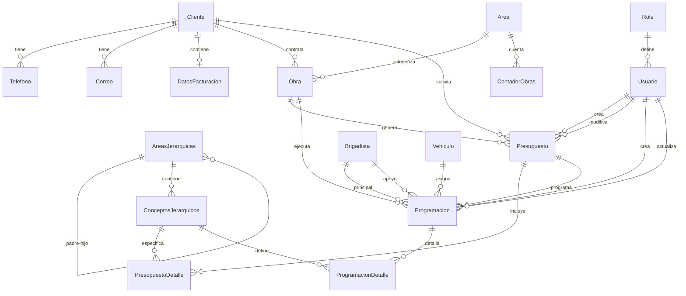

# 🗄️ Esquema de Base de Datos - LaboratorioLao

## 📋 Información General

La base de datos de LaboratorioLao está diseñada para gestionar de manera eficiente todas las operaciones de un laboratorio de control de calidad. Utiliza MySQL como motor de base de datos y Prisma como ORM.

### 🏗️ Principios de Diseño
- **Normalización**: Evita redundancia y garantiza integridad
- **Relaciones bien definidas**: Foreign keys y constraints apropiados
- **Escalabilidad**: Diseño preparado para crecimiento
- **Auditabilidad**: Campos de seguimiento de cambios
- **Flexibilidad**: Estructura jerárquica adaptable

---

## 📊 Diagrama de Relaciones



---

## 📋 Entidades Principales

### 👤 **Cliente**
Almacena información de clientes (personas físicas o morales)

| Campo | Tipo | Descripción | Restricciones |
|-------|------|-------------|---------------|
| `id` | INT | Identificador único | PK, Auto-increment |
| `nombre` | VARCHAR(255) | Nombre o Razón Social | Nullable |
| `direccion` | VARCHAR(500) | Dirección fiscal/contacto | Nullable |
| `representanteLegal` | VARCHAR(255) | Representante legal | Nullable |
| `contactoPagos` | VARCHAR(255) | Contacto para pagos | Nullable |
| `telefonoPagos` | VARCHAR(20) | Teléfono de pagos | Nullable |
| `metodoPago` | ENUM | Método de pago preferido | Default: EFECTIVO |
| `correoFacturacion` | VARCHAR(255) | Email para facturas | Nullable |
| `fechaRegistro` | DATETIME | Fecha de registro | Nullable |
| `activo` | BOOLEAN | Estado del cliente | Default: true |

**Relaciones:**
- Uno a muchos con `Telefono`
- Uno a muchos con `Correo`
- Uno a uno con `DatosFacturacion`
- Uno a muchos con `Presupuesto`
- Uno a muchos con `Obra`

### 📞 **Telefono**
Teléfonos de contacto del cliente

| Campo | Tipo | Descripción | Restricciones |
|-------|------|-------------|---------------|
| `id` | INT | Identificador único | PK, Auto-increment |
| `clienteId` | INT | ID del cliente | FK → Cliente.id |
| `telefono` | VARCHAR(255) | Número telefónico | Required |

### 📧 **Correo**
Correos electrónicos del cliente

| Campo | Tipo | Descripción | Restricciones |
|-------|------|-------------|---------------|
| `id` | INT | Identificador único | PK, Auto-increment |
| `clienteId` | INT | ID del cliente | FK → Cliente.id |
| `correo` | VARCHAR(255) | Dirección de email | Required |

### 🧾 **DatosFacturacion**
Información fiscal del cliente

| Campo | Tipo | Descripción | Restricciones |
|-------|------|-------------|---------------|
| `id` | INT | Identificador único | PK, Auto-increment |
| `clienteId` | INT | ID del cliente | FK → Cliente.id, Unique |
| `rfc` | VARCHAR(13) | RFC del cliente | Required |
| `regimenFiscal` | ENUM | Régimen fiscal | Required |
| `usoCfdi` | ENUM | Uso de CFDI | Required |
| `tipoPago` | ENUM | Tipo de pago | Default: PUE |

**Enums:**
- `RegimenFiscal`: PERSONAS_FISICAS_CON_ACTIVIDADES_EMPRESARIALES, PERSONAS_MORALES, etc.
- `UsoCFDI`: GASTOS_EN_GENERAL, EQUIPOS_DE_COMPUTO, etc.
- `TipoPago`: PUE (Una exhibición), PPD (Parcialidades)

---

### 🏗️ **Obra**
Proyectos o obras de construcción

| Campo | Tipo | Descripción | Restricciones |
|-------|------|-------------|---------------|
| `clave` | VARCHAR(20) | Clave única de obra | PK |
| `areaCodigo` | VARCHAR(50) | Código del área | FK → Area.codigo |
| `nombre` | VARCHAR(255) | Nombre del proyecto | Required |
| `descripcion` | TEXT | Descripción detallada | Nullable |
| `responsable` | VARCHAR(255) | Responsable de obra | Nullable |
| `contacto` | VARCHAR(255) | Información de contacto | Nullable |
| `direccion` | VARCHAR(500) | Ubicación de la obra | Nullable |
| `contratista` | VARCHAR(255) | Empresa contratista | Nullable |
| `estado` | TINYINT | Estado de la obra (1-5) | Nullable |
| `fechaInicio` | TIMESTAMP | Fecha de inicio | Nullable |
| `clienteId` | INT | Cliente asociado | FK → Cliente.id |
| `alcance` | TEXT | Alcance del proyecto | Nullable |
| `razonCancelacion` | TEXT | Motivo de cancelación | Nullable |
| `fechaCreacion` | DATETIME(3) | Fecha de creación | Default: now() |
| `fechaActualizacion` | DATETIME(3) | Última actualización | Auto-update |
| `creadoPor` | VARCHAR(255) | Usuario creador | Nullable |
| `actualizadoPor` | VARCHAR(255) | Último usuario modificador | Nullable |

**Estados de Obra:**
1. Iniciada
2. En proceso
3. Pausada
4. Completada
5. Cancelada

### 🏢 **Area**
Áreas de clasificación de obras

| Campo | Tipo | Descripción | Restricciones |
|-------|------|-------------|---------------|
| `codigo` | VARCHAR(50) | Código del área | PK |
| `nombre` | VARCHAR(255) | Nombre del área | Nullable |

### 🔢 **ContadorObras**
Contador de obras por área y año

| Campo | Tipo | Descripción | Restricciones |
|-------|------|-------------|---------------|
| `areaCodigo` | VARCHAR(50) | Código del área | FK → Area.codigo |
| `año` | INT | Año del contador | Composite PK |
| `contador` | INT | Número actual | Default: 0 |

---

### 💰 **Presupuesto**
Presupuestos de servicios de laboratorio

| Campo | Tipo | Descripción | Restricciones |
|-------|------|-------------|---------------|
| `id` | INT | Identificador único | PK, Auto-increment |
| `claveObra` | VARCHAR(20) | Clave de obra asociada | FK → Obra.clave |
| `clienteId` | INT | Cliente solicitante | FK → Cliente.id |
| `usuarioId` | INT | Usuario creador | FK → Usuario.id |
| `ultimoUsuarioId` | INT | Último usuario modificador | FK → Usuario.id |
| `iva` | DECIMAL(5,4) | Porcentaje de IVA | Default: 0.1600 |
| `subtotal` | DECIMAL(12,2) | Subtotal sin IVA | Default: 0 |
| `ivaMonto` | DECIMAL(12,2) | Monto del IVA | Default: 0 |
| `total` | DECIMAL(12,2) | Total con IVA | Default: 0 |
| `manejaAnticipo` | BOOLEAN | Maneja anticipo | Default: false |
| `porcentajeAnticipo` | DECIMAL(5,2) | Porcentaje de anticipo | Nullable |
| `estado` | ENUM | Estado del presupuesto | Default: borrador |
| `fechaSolicitud` | TIMESTAMP | Fecha de solicitud | Default: now() |
| `razonRechazo` | TEXT | Motivo de rechazo | Nullable |
| `tipoAprobacion` | ENUM | Tipo de aprobación | Nullable |
| `updatedAt` | DATETIME | Última actualización | Auto-update |

**Estados de Presupuesto:**
- `borrador`: En elaboración
- `enviado`: Enviado al cliente
- `aprobado`: Aprobado por cliente
- `rechazado`: Rechazado
- `finalizado`: Trabajos completados

**Tipos de Aprobación:**
- `cliente`: Aprobado por cliente
- `interno`: Aprobación interna

### 📝 **PresupuestoDetalle**
Detalles/conceptos del presupuesto

| Campo | Tipo | Descripción | Restricciones |
|-------|------|-------------|---------------|
| `id` | INT | Identificador único | PK, Auto-increment |
| `presupuestoId` | INT | ID del presupuesto | FK → Presupuesto.id |
| `conceptoCodigo` | VARCHAR(50) | Código del concepto | FK → ConceptosJerarquicos.codigo |
| `cantidad` | DECIMAL(10,2) | Cantidad solicitada | Default: 1 |
| `precioUnitario` | DECIMAL(10,2) | Precio por unidad | Required |
| `subtotal` | DECIMAL(12,2) | Subtotal del renglón | Nullable |
| `estado` | ENUM | Estado del detalle | Default: en_proceso |

**Estados de Detalle:**
- `en_proceso`: Pendiente de ejecutar
- `completado`: Trabajo terminado
- `cancelado`: Cancelado

---

### 🌳 **AreasJerarquicas**
Estructura jerárquica de áreas de servicios

| Campo | Tipo | Descripción | Restricciones |
|-------|------|-------------|---------------|
| `id` | INT | Identificador único | PK, Auto-increment |
| `codigo` | VARCHAR(20) | Código jerárquico | Unique |
| `nombre` | TEXT | Nombre del área | Required |
| `padreId` | INT | ID del área padre | FK → AreasJerarquicas.id |
| `nivel` | INT | Nivel en la jerarquía | Required |
| `createdAt` | DATETIME | Fecha de creación | Default: now() |
| `updatedAt` | DATETIME | Última actualización | Auto-update |

**Ejemplo de Jerarquía:**
```
2 - CONTROL DE CALIDAD (nivel 1)
├── 2.1 - TERRACERÍAS (nivel 2)
│   ├── 2.1.1 - TRABAJOS DE CAMPO (nivel 3)
│   │   ├── 2.1.1.1 - VISITA PARA DETERMINACIÓN... (concepto)
│   │   └── 2.1.1.2 - ENSAYE ADICIONAL... (concepto)
│   └── 2.1.2 - TRABAJOS DE LABORATORIO (nivel 3)
└── 2.2 - PAVIMENTOS (nivel 2)
```

### 🔧 **ConceptosJerarquicos**
Servicios específicos que se pueden presupuestar

| Campo | Tipo | Descripción | Restricciones |
|-------|------|-------------|---------------|
| `id` | INT | Identificador único | PK, Auto-increment |
| `codigo` | VARCHAR(20) | Código del concepto | Unique |
| `descripcion` | TEXT | Descripción detallada | Required |
| `unidad` | VARCHAR(50) | Unidad de medida | Required |
| `precioUnitario` | DECIMAL(10,2) | Precio por unidad | Required |
| `areaId` | INT | Área padre | FK → AreasJerarquicas.id |
| `createdAt` | DATETIME | Fecha de creación | Default: now() |
| `updatedAt` | DATETIME | Última actualización | Auto-update |

---

### 👤 **Usuario**
Usuarios del sistema

| Campo | Tipo | Descripción | Restricciones |
|-------|------|-------------|---------------|
| `id` | INT | Identificador único | PK, Auto-increment |
| `email` | VARCHAR(255) | Correo electrónico | Unique |
| `nombre` | VARCHAR(100) | Nombre(s) | Required |
| `apellidos` | VARCHAR(100) | Apellidos | Required |
| `password` | VARCHAR(255) | Contraseña hasheada | Required |
| `rolId` | INT | ID del rol | FK → Role.id |
| `activo` | BOOLEAN | Usuario activo | Default: true |
| `ultimoAcceso` | DATETIME | Último inicio de sesión | Nullable |
| `fechaCreacion` | DATETIME | Fecha de registro | Default: now() |
| `fechaActualizacion` | DATETIME | Última actualización | Auto-update |

### 🛡️ **Role**
Roles de usuario

| Campo | Tipo | Descripción | Restricciones |
|-------|------|-------------|---------------|
| `id` | INT | Identificador único | PK, Auto-increment |
| `nombre` | VARCHAR(50) | Nombre del rol | Unique |
| `descripcion` | VARCHAR(255) | Descripción del rol | Nullable |

**Roles Disponibles:**
- `admin`: Administrador del sistema
- `recepcionista`: Personal de recepción
- `jefe_laboratorio`: Jefe de laboratorio

---

### 📅 **Programacion**
Programación de actividades de laboratorio

| Campo | Tipo | Descripción | Restricciones |
|-------|------|-------------|---------------|
| `id` | INT | Identificador único | PK, Auto-increment |
| `presupuestoId` | INT | Presupuesto asociado | FK → Presupuesto.id |
| `claveObra` | VARCHAR(20) | Clave de obra | FK → Obra.clave |
| `fechaProgramada` | DATETIME | Fecha programada | Required |
| `horaProgramada` | VARCHAR(10) | Hora programada (HH:MM) | Required |
| `tipoProgramacion` | ENUM | Tipo de programación | Required |
| `nombreResidente` | VARCHAR(255) | Nombre del residente | Nullable |
| `telefonoResidente` | VARCHAR(20) | Teléfono del residente | Nullable |
| `observacionesIniciales` | TEXT | Observaciones iniciales | Nullable |
| `brigadistaPrincipalId` | INT | Brigadista principal | FK → Brigadista.id |
| `brigadistaApoyoId` | INT | Brigadista apoyo | FK → Brigadista.id |
| `vehiculoId` | INT | Vehículo asignado | FK → Vehiculo.id |
| `claveEquipo` | VARCHAR(50) | Equipo utilizado | Nullable |
| `herramientasEspeciales` | TEXT | Herramientas especiales | Nullable |
| `observacionesProgramacion` | TEXT | Observaciones | Nullable |
| `instruccionesBrigadista` | TEXT | Instrucciones | Nullable |
| `condicionesEspeciales` | TEXT | Condiciones especiales | Nullable |
| `estado` | ENUM | Estado | Default: programada |
| `motivoCancelacion` | TEXT | Motivo de cancelación | Nullable |
| `observacionesComplecion` | TEXT | Observaciones finales | Nullable |
| `fechaCreacion` | DATETIME | Fecha de creación | Default: now() |
| `fechaActualizacion` | DATETIME | Última actualización | Auto-update |
| `fechaInicio` | DATETIME | Fecha de inicio real | Nullable |
| `fechaComplecion` | DATETIME | Fecha de terminación | Nullable |
| `creadoPor` | INT | Usuario creador | FK → Usuario.id |
| `actualizadoPor` | INT | Usuario actualizador | FK → Usuario.id |

**Estados de Programación:**
- `programada`: Programada
- `en_proceso`: En ejecución
- `completada`: Completada
- `cancelada`: Cancelada
- `reprogramada`: Reprogramada

**Tipos de Programación:**
- `obra_por_visita`: Obra por visita
- `obra_por_estancia`: Obra por estancia

### 📋 **ProgramacionDetalle**
Detalles de actividades en cada programación

| Campo | Tipo | Descripción | Restricciones |
|-------|------|-------------|---------------|
| `id` | INT | Identificador único | PK, Auto-increment |
| `programacionId` | INT | ID de programación | FK → Programacion.id |
| `conceptoCodigo` | VARCHAR(50) | Código del concepto | FK → ConceptosJerarquicos.codigo |
| `cantidadMuestras` | INT | Cantidad de muestras | Required |
| `tipoRecoleccion` | ENUM | Tipo de recolección | Required |
| `distribucionMuestras` | TEXT | Distribución de muestras | Nullable |
| `muestrasObtenidas` | INT | Muestras obtenidas | Nullable |
| `observaciones` | TEXT | Observaciones | Nullable |
| `esNoPresupuestado` | BOOLEAN | No presupuestado | Default: false |
| `descripcionConcepto` | TEXT | Descripción concepto | Nullable |
| `unidadMedida` | VARCHAR(50) | Unidad de medida | Nullable |
| `fechaCreacion` | DATETIME | Fecha de creación | Default: now() |
| `fechaActualizacion` | DATETIME | Última actualización | Auto-update |

**Tipos de Recolección:**
- `metros_cuadrados`: m²
- `metros_cubicos`: m³
- `metros_lineales`: ml
- `sondeo`: Sondeo
- `piezas`: Piezas
- `condensacion`: Condensación

### 👷 **Brigadista**
Personal de campo del laboratorio

| Campo | Tipo | Descripción | Restricciones |
|-------|------|-------------|---------------|
| `id` | INT | Identificador único | PK, Auto-increment |
| `nombre` | VARCHAR(100) | Nombre(s) | Required |
| `apellidos` | VARCHAR(100) | Apellidos | Required |
| `telefono` | VARCHAR(20) | Teléfono de contacto | Nullable |
| `email` | VARCHAR(255) | Correo electrónico | Nullable |
| `activo` | BOOLEAN | Brigadista activo | Default: true |
| `fechaRegistro` | DATETIME | Fecha de registro | Default: now() |
| `fechaActualizacion` | DATETIME | Última actualización | Auto-update |

### 🚗 **Vehiculo**
Vehículos del laboratorio

| Campo | Tipo | Descripción | Restricciones |
|-------|------|-------------|---------------|
| `id` | INT | Identificador único | PK, Auto-increment |
| `clave` | VARCHAR(20) | Clave del vehículo | Unique |
| `marca` | VARCHAR(50) | Marca del vehículo | Nullable |
| `modelo` | VARCHAR(50) | Modelo del vehículo | Nullable |
| `año` | INT | Año del vehículo | Nullable |
| `placas` | VARCHAR(15) | Placas del vehículo | Nullable |
| `activo` | BOOLEAN | Vehículo activo | Default: true |
| `fechaRegistro` | DATETIME | Fecha de registro | Default: now() |
| `fechaActualizacion` | DATETIME | Última actualización | Auto-update |

---

## 📊 Índices de Base de Datos

### Índices Principales
- **Clientes**: idx_telefonos_cliente_id, idx_correos_cliente_id
- **Obras**: idx_obra_area_codigo, idx_obra_cliente_id
- **Presupuestos**: idx_presupuestos_clave_obra, idx_presupuestos_usuario_id
- **Detalles**: idx_presupuestodetalle_presupuesto_id, idx_presupuestodetalle_concepto_codigo
- **Sistema Jerárquico**: idx_areas_nivel, idx_areas_padre_id, idx_conceptos_area_id
- **Programación**: idx_programacion_presupuesto_id, idx_programacion_fecha_programada
- **Usuarios**: idx_usuario_rol, idx_usuario_email
- **Recursos**: idx_brigadista_activo, idx_vehiculo_activo

### Optimizaciones de Consulta
- Índices compuestos para filtros comunes
- Índices en campos de fechas para rangos
- Índices únicos en códigos y claves
- Índices en foreign keys para joins

---

## 🔄 Triggers y Procedimientos

### Cálculos Automáticos
- **Presupuesto**: Recalculo de totales al modificar detalles
- **Obra**: Generación automática de claves
- **Auditoria**: Actualización automática de fechas

### Validaciones
- **Integridad referencial**: Foreign keys con restricciones
- **Validaciones de negocio**: Estados válidos, rangos de fechas
- **Consistencia**: Validación de datos relacionados

---

## 📈 Consideraciones de Rendimiento

### Optimizaciones Implementadas
- **Consultas lazy loading**: Carga bajo demanda
- **Paginación**: Límites en consultas grandes
- **Índices estratégicos**: En campos de búsqueda frecuente
- **Campos calculados**: Para evitar cálculos repetitivos

### Métricas de Rendimiento
- **Presupuestos**: < 100ms para listados
- **Búsquedas**: < 50ms con índices
- **Reportes**: < 500ms para agregaciones
- **Inserción**: < 10ms para operaciones simples

---

## 🔧 Mantenimiento y Backup

### Estrategia de Backup
- **Backup diario**: Estructura completa
- **Backup incremental**: Cada 4 horas
- **Retención**: 30 días automática
- **Verificación**: Testing de restore semanal

### Tareas de Mantenimiento
- **Limpieza de logs**: Rotación automática
- **Optimización de índices**: Análisis mensual
- **Estadísticas**: Actualización semanal
- **Monitoreo**: Alertas de rendimiento

---

*Documentación de esquema de base de datos generada para LaboratorioLao v1.0.0*