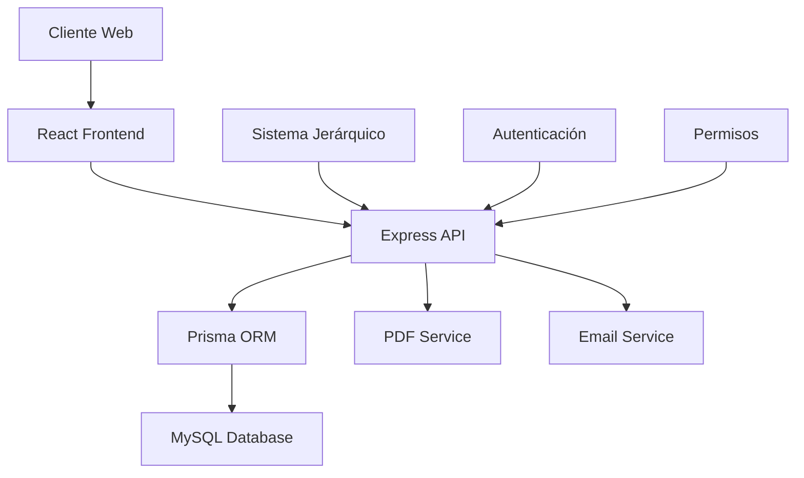
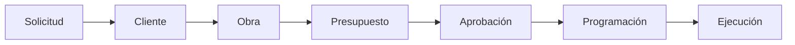

# 📚 Documentación LaboratorioLao

Bienvenido a la documentación completa del sistema LaboratorioLao. Esta carpeta contiene toda la información necesaria para entender, instalar, usar y desarrollar el sistema.

## 📋 Índice de Documentación

### 🚀 Para Empezar
- **[README Principal](../README.md)** - Información general y getting started
- **[Guía de Instalación](./INSTALLATION_GUIDE.md)** - Instalación paso a paso

### 👥 Para Usuarios
- **[Flujos de Usuario](./USER_FLOWS.md)** - Procesos y flujos de trabajo por rol
- **Manual de Usuario** (por crear) - Guía de uso del sistema

### 👨‍💻 Para Desarrolladores
- **[Guía de Desarrollo](./DEVELOPMENT_GUIDE.md)** - Mejores prácticas y convenciones
- **[Arquitectura Técnica](./TECHNICAL_ARCHITECTURE.md)** - Arquitectura y patrones de diseño
- **[API Documentation](./API_DOCUMENTATION.md)** - Referencia completa de la API
- **[Base de Datos](./DATABASE_SCHEMA.md)** - Esquema y estructura de datos

### 🔧 Documentación Técnica Adicional
- **[Seguridad de Presupuestos](../SEGURIDAD_PRESUPUESTOS.md)** - Sistema de permisos
- **[Resultados de Pruebas](../RESULTADOS_PRUEBAS_ENDPOINTS.md)** - Validación de endpoints

---

## 🎯 ¿Qué es LaboratorioLao?

LaboratorioLao es un **sistema integral de gestión para laboratorios de control de calidad** en construcción. Permite administrar:

- 💰 **Presupuestos** - Desde solicitud hasta aprobación
- 👥 **Clientes** - Base de datos completa con datos fiscales  
- 🏗️ **Obras** - Proyectos y seguimiento de avances
- 📅 **Programación** - Calendario y asignación de recursos
- 🔐 **Usuarios** - Sistema de autenticación y roles
- 📄 **Documentos** - Generación automática de PDF

## 🛠️ Stack Tecnológico

### Frontend
- **React 18** + **TypeScript**
- **Tailwind CSS** + **Radix UI**
- **TanStack Query** + **React Hook Form**
- **Vite** (bundler)

### Backend
- **Node.js** + **Express**
- **Prisma ORM** + **MySQL**
- **TypeScript** + **Zod** (validación)
- **Puppeteer** (PDF generation)

## 📖 Cómo Usar Esta Documentación

### 🎯 Si eres nuevo en el proyecto:
1. Lee el [README principal](../README.md) para entender qué hace el sistema
2. Sigue la [Guía de Instalación](./INSTALLATION_GUIDE.md) para configurar tu entorno
3. Revisa los [Flujos de Usuario](./USER_FLOWS.md) para entender los procesos

### 👨‍💻 Si vas a desarrollar:
1. Configura tu entorno con la [Guía de Instalación](./INSTALLATION_GUIDE.md)
2. Lee la [Guía de Desarrollo](./DEVELOPMENT_GUIDE.md) para conocer las convenciones
3. Estudia la [Arquitectura Técnica](./TECHNICAL_ARCHITECTURE.md) para entender la estructura
4. Consulta la [API Documentation](./API_DOCUMENTATION.md) para los endpoints

### 🗄️ Si necesitas información de base de datos:
1. Revisa el [Esquema de Base de Datos](./DATABASE_SCHEMA.md) para entender las relaciones
2. Consulta los archivos de pruebas para ejemplos de datos

### 🔧 Si vas a hacer deploy:
1. Sigue la sección de producción en la [Guía de Instalación](./INSTALLATION_GUIDE.md)
2. Consulta la [Arquitectura Técnica](./TECHNICAL_ARCHITECTURE.md) para configuración avanzada

## 📊 Estructura del Sistema

## 🔄 Flujo Principal del Sistema

## 🎭 Roles del Sistema

### 🔐 Administrador
- Acceso total al sistema
- Gestión de usuarios
- Configuración del sistema jerárquico
- Reportes y estadísticas

### 👩‍💼 Recepcionista  
- Gestión de clientes
- Creación de presupuestos
- Solo ve sus propios presupuestos
- Generación de documentos

### 👨‍🔬 Jefe de Laboratorio
- Gestión de programación
- Asignación de recursos
- Seguimiento de actividades
- Reportes de productividad

## 📈 Características Principales

### ✨ Gestión de Presupuestos
- Estructura jerárquica de conceptos
- Cálculos automáticos de IVA y totales
- Generación de PDF profesional
- Control de estados y permisos
- Histórico de cambios

### 👥 Gestión de Clientes
- Base completa con datos fiscales
- Múltiples contactos por cliente
- Configuración de métodos de pago
- Historial de proyectos

### 🏗️ Gestión de Obras
- Generación automática de claves
- Seguimiento de estados
- Vinculación con clientes
- Control de responsables

### 📅 Programación de Actividades
- Calendario visual
- Asignación de brigadistas y vehículos
- Control de muestras y resultados
- Seguimiento en tiempo real

## 🔒 Seguridad

- **Autenticación** basada en sesiones
- **Permisos granulares** por usuario
- **Validación** de entrada con Zod
- **Protección** contra SQL injection y XSS
- **Encriptación** de contraseñas

## 📊 Métricas y Rendimiento

- **Frontend**: < 2s tiempo de carga
- **API**: < 200ms tiempo de respuesta
- **Base de datos**: Consultas optimizadas con índices
- **Escalabilidad**: Preparado para clustering

## 🧪 Testing

- **Unit tests** para componentes y servicios
- **Integration tests** para API endpoints
- **E2E tests** para flujos críticos
- **Validation tests** para esquemas de datos

## 🚀 Deployment

- **Desarrollo**: npm run dev
- **Producción**: PM2 + Nginx + SSL
- **Base de datos**: MySQL con backups automáticos
- **Monitoreo**: Logs estructurados y métricas

## 📞 Soporte

### 🆘 Encontrar Ayuda

1. **Busca en esta documentación** - La mayoría de preguntas están respondidas aquí
2. **Revisa los ejemplos** - Hay ejemplos de código en cada documento
3. **Consulta los tests** - Los tests muestran cómo usar las funciones
4. **GitHub Issues** - Para reportar bugs o solicitar funcionalidades

### 📧 Contacto

- **Desarrollador**: anglfer
- **Repositorio**: https://github.com/anglfer/LaboratorioLao
- **Issues**: https://github.com/anglfer/LaboratorioLao/issues

## 📄 Licencia

Este proyecto está bajo la licencia MIT. Ver el archivo `LICENSE` para más detalles.

---

## 🔄 Actualizaciones de Documentación

Esta documentación se actualiza regularmente. Última actualización: **Septiembre 2024**

### Historial de Cambios
- **v1.0.0** - Documentación inicial completa
- **v1.0.1** - Adición de guía de desarrollo
- **v1.0.2** - Mejoras en diagramas y ejemplos

---

*¿Falta algo en la documentación? [Abre un issue](https://github.com/anglfer/LaboratorioLao/issues) para sugerencias.*