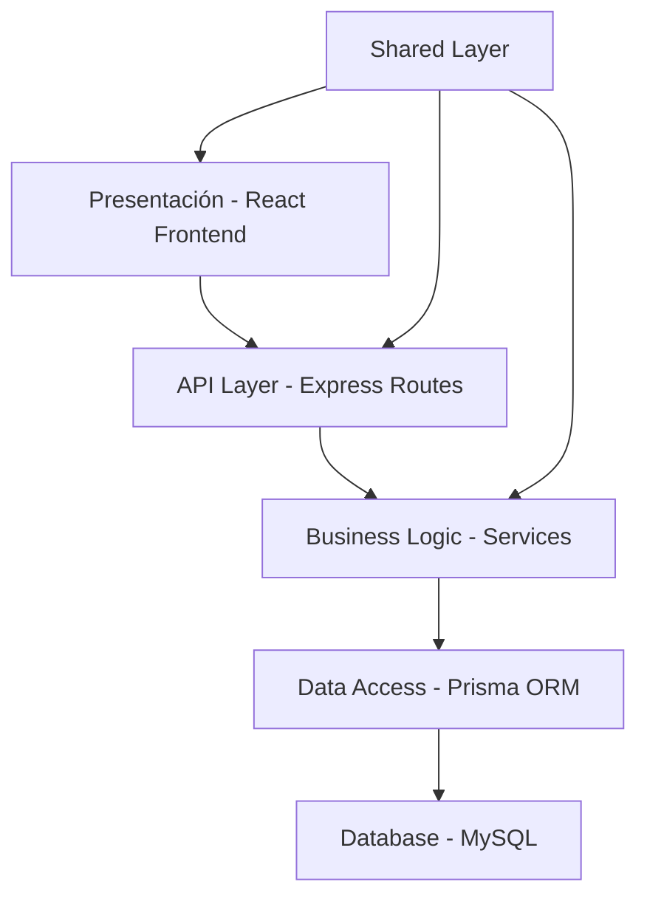
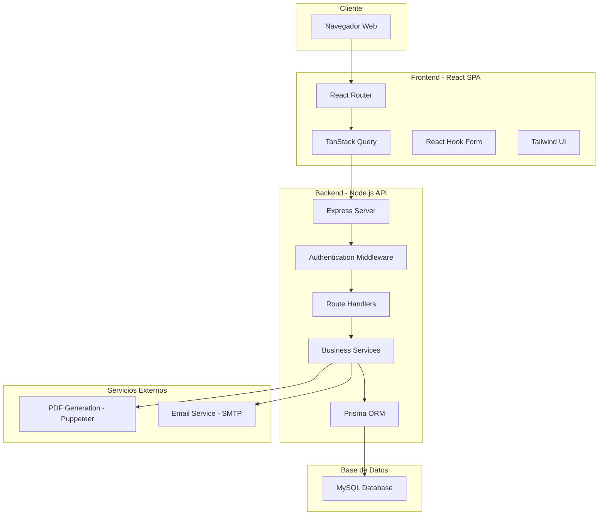
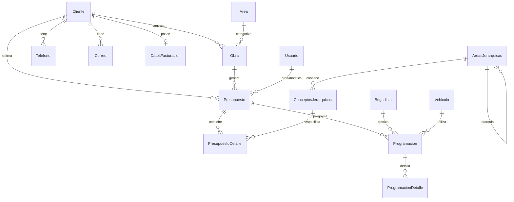
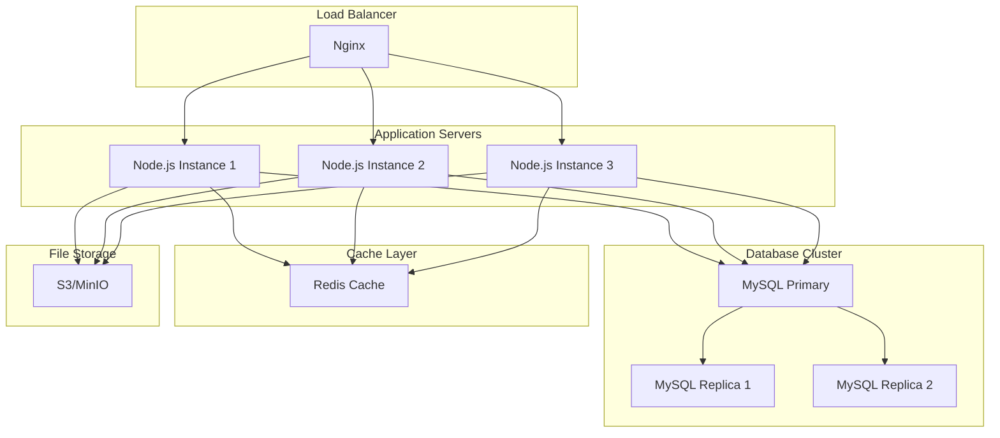

# 🏗️ Arquitectura Técnica - LaboratorioLao

## 📋 Información General

Este documento describe la arquitectura técnica del sistema LaboratorioLao, incluyendo patrones de diseño, decisiones arquitectónicas, estructura de código y consideraciones de escalabilidad.

---

## 🎯 Principios Arquitectónicos

### 🧩 **Separación de Responsabilidades**
- **Frontend**: Interfaz de usuario y experiencia del usuario
- **Backend**: Lógica de negocio y API REST
- **Base de Datos**: Persistencia y modelado de datos
- **Shared**: Código compartido entre frontend y backend

### 🔄 **Arquitectura en Capas**


### 📦 **Modularidad**
- Organización por features/dominios
- Componentes reutilizables
- Servicios especializados
- Hooks customizados

---

## 🏛️ Arquitectura del Sistema

### 🔗 Diagrama de Arquitectura General



### 🌐 Patrón Cliente-Servidor

#### **Frontend (Cliente)**
- **SPA (Single Page Application)** con React
- **CSR (Client Side Rendering)** para interactividad
- **Estado local** gestionado con hooks
- **Cache de servidor** con TanStack Query

#### **Backend (Servidor)**
- **API REST** con Express.js
- **Autenticación** basada en sesiones
- **Middleware** para autorización y validación
- **ORM** para abstracción de base de datos

---

## 🎨 Arquitectura Frontend

### 📁 Estructura de Carpetas

```
client/src/
├── app/                    # Configuración de la aplicación
│   ├── App.tsx            # Componente raíz
│   ├── not-found.tsx      # Página 404
│   └── router.tsx         # Configuración de rutas
├── features/              # Módulos por dominio
│   ├── budgets/           # Gestión de presupuestos
│   │   ├── components/    # Componentes específicos
│   │   ├── hooks/         # Hooks customizados
│   │   ├── pages/         # Páginas/vistas
│   │   ├── services/      # Servicios API
│   │   └── types/         # Tipos específicos
│   ├── clientes/          # Gestión de clientes
│   ├── concepts/          # Sistema jerárquico
│   ├── dashboard/         # Panel principal
│   ├── obras/             # Gestión de obras
│   └── programming/       # Programación
├── shared/                # Código compartido
│   ├── components/        # Componentes reutilizables
│   │   ├── ui/           # Componentes de UI base
│   │   ├── Layout.tsx    # Layout principal
│   │   └── LoginForm.tsx # Formulario de login
│   ├── hooks/            # Hooks compartidos
│   ├── services/         # Servicios base
│   └── types/            # Tipos compartidos
└── types/                # Tipos globales
```

### 🔧 Patrones de Diseño Frontend

#### **Feature-Based Architecture**
```typescript
// Estructura por feature
features/
├── budgets/
│   ├── components/
│   │   ├── BudgetForm.tsx
│   │   ├── BudgetList.tsx
│   │   └── BudgetCard.tsx
│   ├── hooks/
│   │   ├── useBudgets.ts
│   │   └── useBudgetForm.ts
│   ├── services/
│   │   └── budgetService.ts
│   └── types/
│       └── budget.ts
```

#### **Component Composition Pattern**
```typescript
// Ejemplo de composición
export function BudgetPage() {
  return (
    <Layout>
      <BudgetHeader />
      <BudgetFilters />
      <BudgetList />
      <BudgetPagination />
    </Layout>
  );
}
```

#### **Custom Hooks Pattern**
```typescript
// Hook para gestión de presupuestos
export function useBudgets() {
  const query = useQuery({
    queryKey: ['budgets'],
    queryFn: budgetService.getAll
  });
  
  const createMutation = useMutation({
    mutationFn: budgetService.create,
    onSuccess: () => {
      queryClient.invalidateQueries(['budgets']);
    }
  });
  
  return {
    budgets: query.data,
    isLoading: query.isLoading,
    createBudget: createMutation.mutate,
    isCreating: createMutation.isLoading
  };
}
```

### 🎨 Sistema de Diseño

#### **Tailwind CSS + Radix UI**
```typescript
// Componente base con Tailwind
export function Button({ variant = "default", size = "md", ...props }) {
  return (
    <button
      className={cn(
        "inline-flex items-center justify-center rounded-md font-medium transition-colors",
        {
          "bg-primary text-primary-foreground hover:bg-primary/90": variant === "default",
          "border border-input bg-background hover:bg-accent": variant === "outline",
          "h-10 px-4 py-2": size === "default",
          "h-9 rounded-md px-3": size === "sm"
        }
      )}
      {...props}
    />
  );
}
```

#### **Theme Configuration**
```javascript
// tailwind.config.ts
module.exports = {
  theme: {
    extend: {
      colors: {
        primary: {
          50: '#eff6ff',
          500: '#3b82f6',
          900: '#1e3a8a'
        }
      },
      fontFamily: {
        sans: ['Inter', 'sans-serif']
      }
    }
  }
};
```

---

## ⚙️ Arquitectura Backend

### 📁 Estructura de Carpetas

```
server/
├── index.ts               # Punto de entrada
├── routes.ts              # Rutas principales
├── routes-areas.ts        # Rutas de áreas jerárquicas
├── routes-conceptos.ts    # Rutas de conceptos
├── routes-programming.ts  # Rutas de programación
├── storage.ts             # Capa de acceso a datos
├── prisma.ts              # Configuración de Prisma
├── pdf-service.ts         # Servicio de PDF
├── pdf-template.ts        # Templates de PDF
├── seed.ts                # Datos iniciales
└── vite.ts               # Configuración para servir frontend
```

### 🏗️ Patrones de Diseño Backend

#### **Repository Pattern**
```typescript
// storage.ts - Abstracción de acceso a datos
class DataStorage {
  async getAllClientes(): Promise<Cliente[]> {
    return await prisma.cliente.findMany({
      include: {
        telefonos: true,
        correos: true,
        datosFacturacion: true
      }
    });
  }
  
  async createCliente(data: ClienteData): Promise<Cliente> {
    return await prisma.cliente.create({
      data: {
        ...data,
        telefonos: {
          create: data.telefonos?.map(t => ({ telefono: t }))
        }
      }
    });
  }
}
```

#### **Middleware Pattern**
```typescript
// Middleware de autenticación
function requireAuth(req: any): SessionUser {
  const sessionUser = req.session?.user as SessionUser | undefined;
  if (!sessionUser) {
    throw new Error("UNAUTHORIZED");
  }
  return sessionUser;
}

// Middleware de permisos
async function requireBudgetPermission(
  budgetId: number, 
  user: SessionUser, 
  action: 'read' | 'write'
) {
  const budget = await storage.getBudgetById(budgetId);
  if (!budget) throw new Error("NOT_FOUND");
  
  const isAdmin = user.rol === 'admin';
  const isOwner = budget.usuarioId === user.id;
  
  if (!isAdmin && !isOwner) {
    throw new Error("FORBIDDEN");
  }
  
  return budget;
}
```

#### **Service Layer Pattern**
```typescript
// pdf-service.ts - Servicio especializado
export class PDFService {
  private static browser: Browser | null = null;
  
  static async generatePDF(html: string): Promise<Buffer> {
    const browser = await this.getBrowser();
    const page = await browser.newPage();
    
    await page.setContent(html, { waitUntil: 'networkidle0' });
    
    const pdf = await page.pdf({
      format: 'A4',
      margin: { top: '20mm', bottom: '20mm', left: '15mm', right: '15mm' }
    });
    
    await page.close();
    return pdf;
  }
}
```

### 📊 API Design Patterns

#### **RESTful API Structure**
```typescript
// Estructura consistente de endpoints
app.get('/api/presupuestos', listBudgets);           // GET - Listar
app.post('/api/presupuestos', createBudget);         // POST - Crear
app.get('/api/presupuestos/:id', getBudget);         // GET - Obtener uno
app.put('/api/presupuestos/:id', updateBudget);      // PUT - Actualizar
app.delete('/api/presupuestos/:id', deleteBudget);   // DELETE - Eliminar

// Endpoints especializados
app.get('/api/presupuestos/:id/pdf', generatePDF);   // Acción específica
app.get('/api/presupuestos/:id/preview', getPreview); // Vista previa
```

#### **Error Handling Pattern**
```typescript
// Manejo consistente de errores
app.use((error: any, req: Request, res: Response, next: NextFunction) => {
  console.error('[ERROR]', error.message);
  
  if (error.message === 'UNAUTHORIZED') {
    return res.status(401).json({ error: 'No autorizado' });
  }
  
  if (error.message === 'FORBIDDEN') {
    return res.status(403).json({ error: 'Sin permisos' });
  }
  
  if (error.message === 'NOT_FOUND') {
    return res.status(404).json({ error: 'Recurso no encontrado' });
  }
  
  return res.status(500).json({ error: 'Error interno del servidor' });
});
```

---

## 🗄️ Arquitectura de Base de Datos

### 📊 Modelo Relacional



### 🔄 Patrones de Base de Datos

#### **Prisma ORM Configuration**
```typescript
// schema.prisma - Modelo de dominio
model Presupuesto {
  id                Int                  @id @default(autoincrement())
  claveObra         String?              @db.VarChar(20)
  clienteId         Int?
  usuarioId         Int?
  
  // Campos monetarios con precisión decimal
  iva              Decimal?             @db.Decimal(5,4) @default(0.1600)
  subtotal         Decimal?             @db.Decimal(12,2) @default(0)
  total            Decimal?             @db.Decimal(12,2) @default(0)
  
  // Estados con enum
  estado           PresupuestoEstado?   @default(borrador)
  
  // Timestamps automáticos
  fechaSolicitud   DateTime?            @default(now())
  updatedAt        DateTime             @updatedAt
  
  // Relaciones
  cliente          Cliente?             @relation(fields: [clienteId], references: [id])
  usuario          Usuario?             @relation(fields: [usuarioId], references: [id])
  detalles         PresupuestoDetalle[]
  
  // Índices para optimización
  @@index([clienteId], name: "idx_presupuestos_cliente_id")
  @@index([usuarioId], name: "idx_presupuestos_usuario_id")
}
```

#### **Query Optimization**
```typescript
// Consultas optimizadas con includes selectivos
const getBudgetWithDetails = async (id: number) => {
  return await prisma.presupuesto.findUnique({
    where: { id },
    include: {
      cliente: {
        select: { id: true, nombre: true, email: true }
      },
      detalles: {
        include: {
          concepto: {
            select: { codigo: true, descripcion: true, unidad: true }
          }
        }
      },
      usuario: {
        select: { id: true, nombre: true, apellidos: true }
      }
    }
  });
};
```

---

## 🔗 Integración y Comunicación

### 📡 Frontend-Backend Communication

#### **API Client Pattern**
```typescript
// services/apiClient.ts
class ApiClient {
  private baseURL = '/api';
  
  async request<T>(endpoint: string, options?: RequestInit): Promise<T> {
    const response = await fetch(`${this.baseURL}${endpoint}`, {
      headers: {
        'Content-Type': 'application/json',
        ...options?.headers
      },
      credentials: 'include', // Para cookies de sesión
      ...options
    });
    
    if (!response.ok) {
      throw new ApiError(response.status, await response.text());
    }
    
    return response.json();
  }
  
  get<T>(endpoint: string): Promise<T> {
    return this.request<T>(endpoint);
  }
  
  post<T>(endpoint: string, data: any): Promise<T> {
    return this.request<T>(endpoint, {
      method: 'POST',
      body: JSON.stringify(data)
    });
  }
}
```

#### **TanStack Query Integration**
```typescript
// hooks/useBudgets.ts
export function useBudgets(filters?: BudgetFilters) {
  return useQuery({
    queryKey: ['budgets', filters],
    queryFn: () => budgetService.getAll(filters),
    staleTime: 5 * 60 * 1000, // 5 minutos
    cacheTime: 10 * 60 * 1000, // 10 minutos
  });
}

export function useCreateBudget() {
  const queryClient = useQueryClient();
  
  return useMutation({
    mutationFn: budgetService.create,
    onSuccess: (newBudget) => {
      // Invalidar cache
      queryClient.invalidateQueries(['budgets']);
      
      // Actualizar cache optimísticamente
      queryClient.setQueryData(['budgets', newBudget.id], newBudget);
    },
    onError: (error) => {
      toast.error('Error al crear presupuesto');
    }
  });
}
```

### 🔒 Authentication & Session Management

#### **Session-based Authentication**
```typescript
// server/index.ts - Configuración de sesiones
app.use(session({
  secret: process.env.SESSION_SECRET!,
  resave: false,
  saveUninitialized: false,
  cookie: {
    secure: process.env.NODE_ENV === 'production',
    httpOnly: true,
    maxAge: 24 * 60 * 60 * 1000 // 24 horas
  },
  store: new MemoryStore({
    checkPeriod: 86400000 // Limpiar cada 24 horas
  })
}));
```

#### **Authentication Context**
```typescript
// context/AuthContext.tsx
interface AuthContextType {
  usuario: Usuario | null;
  login: (email: string, password: string) => Promise<void>;
  logout: () => Promise<void>;
  isLoading: boolean;
}

export function AuthProvider({ children }: { children: React.ReactNode }) {
  const [usuario, setUsuario] = useState<Usuario | null>(null);
  const [isLoading, setIsLoading] = useState(true);
  
  useEffect(() => {
    // Verificar sesión al cargar
    checkSession();
  }, []);
  
  const login = async (email: string, password: string) => {
    const response = await fetch('/api/auth/login', {
      method: 'POST',
      headers: { 'Content-Type': 'application/json' },
      body: JSON.stringify({ email, password }),
      credentials: 'include'
    });
    
    if (response.ok) {
      const user = await response.json();
      setUsuario(user);
    } else {
      throw new Error('Credenciales inválidas');
    }
  };
  
  return (
    <AuthContext.Provider value={{ usuario, login, logout, isLoading }}>
      {children}
    </AuthContext.Provider>
  );
}
```

---

## 📈 Escalabilidad y Rendimiento

### ⚡ Optimizaciones Frontend

#### **Code Splitting**
```typescript
// Lazy loading de rutas
const BudgetsPage = lazy(() => import('./features/budgets/pages/BudgetsPage'));
const ClientsPage = lazy(() => import('./features/clientes/ClientesPage'));

function App() {
  return (
    <Router>
      <Suspense fallback={<LoadingSpinner />}>
        <Routes>
          <Route path="/presupuestos" element={<BudgetsPage />} />
          <Route path="/clientes" element={<ClientsPage />} />
        </Routes>
      </Suspense>
    </Router>
  );
}
```

#### **Memoization**
```typescript
// Optimización de re-renders
const BudgetCard = memo(({ budget }: { budget: Budget }) => {
  const formattedTotal = useMemo(() => 
    new Intl.NumberFormat('es-MX', {
      style: 'currency',
      currency: 'MXN'
    }).format(budget.total), 
    [budget.total]
  );
  
  return (
    <div className="budget-card">
      <h3>{budget.claveObra}</h3>
      <p>{formattedTotal}</p>
    </div>
  );
});
```

### 🚀 Optimizaciones Backend

#### **Database Query Optimization**
```typescript
// Paginación eficiente
async function getPaginatedBudgets(page: number, limit: number) {
  const skip = (page - 1) * limit;
  
  const [budgets, total] = await Promise.all([
    prisma.presupuesto.findMany({
      skip,
      take: limit,
      include: {
        cliente: { select: { id: true, nombre: true } },
        usuario: { select: { id: true, nombre: true } }
      },
      orderBy: { fechaSolicitud: 'desc' }
    }),
    prisma.presupuesto.count()
  ]);
  
  return {
    data: budgets,
    pagination: {
      page,
      limit,
      total,
      pages: Math.ceil(total / limit)
    }
  };
}
```

#### **Caching Strategy**
```typescript
// Cache en memoria para datos frecuentes
class CacheManager {
  private cache = new Map<string, { data: any; expiry: number }>();
  
  set(key: string, data: any, ttl: number = 300000) { // 5 minutos
    this.cache.set(key, {
      data,
      expiry: Date.now() + ttl
    });
  }
  
  get(key: string) {
    const item = this.cache.get(key);
    if (!item || item.expiry < Date.now()) {
      this.cache.delete(key);
      return null;
    }
    return item.data;
  }
}
```

---

## 🔧 Herramientas de Desarrollo

### 🛠️ Development Stack

#### **Build Tools**
- **Vite**: Build tool y dev server
- **TypeScript**: Tipado estático
- **ESLint**: Linting de código
- **Prettier**: Formateo de código

#### **Testing Tools**
- **Vitest**: Testing framework
- **Testing Library**: Testing de componentes React
- **Playwright**: Testing end-to-end

#### **Development Workflow**
```json
// package.json scripts
{
  "scripts": {
    "dev": "concurrently \"npm run dev:server\" \"npm run dev:client\"",
    "dev:server": "tsx watch server/index.ts",
    "dev:client": "vite",
    "build": "vite build && tsc --noEmit",
    "test": "vitest",
    "test:e2e": "playwright test",
    "lint": "eslint . --ext ts,tsx --report-unused-disable-directives --max-warnings 0",
    "format": "prettier --write \"**/*.{ts,tsx,js,jsx,json,md}\""
  }
}
```

### 🔍 Debugging & Monitoring

#### **Logging Strategy**
```typescript
// utils/logger.ts
class Logger {
  private isDevelopment = process.env.NODE_ENV === 'development';
  
  info(message: string, data?: any) {
    console.log(`[INFO] ${new Date().toISOString()}: ${message}`, data);
  }
  
  error(message: string, error?: Error) {
    console.error(`[ERROR] ${new Date().toISOString()}: ${message}`, error);
    
    if (!this.isDevelopment) {
      // Enviar a servicio de logging en producción
      this.sendToExternalService(message, error);
    }
  }
  
  debug(message: string, data?: any) {
    if (this.isDevelopment) {
      console.debug(`[DEBUG] ${message}`, data);
    }
  }
}
```

#### **Error Boundaries**
```typescript
// components/ErrorBoundary.tsx
class ErrorBoundary extends Component<
  { children: React.ReactNode },
  { hasError: boolean; error?: Error }
> {
  constructor(props: any) {
    super(props);
    this.state = { hasError: false };
  }
  
  static getDerivedStateFromError(error: Error) {
    return { hasError: true, error };
  }
  
  componentDidCatch(error: Error, errorInfo: ErrorInfo) {
    console.error('Error boundary caught error:', error, errorInfo);
    
    // Reportar error a servicio de monitoreo
    reportError(error, errorInfo);
  }
  
  render() {
    if (this.state.hasError) {
      return (
        <div className="error-fallback">
          <h2>Algo salió mal</h2>
          <p>Ha ocurrido un error inesperado. Por favor, recarga la página.</p>
          <button onClick={() => window.location.reload()}>
            Recargar página
          </button>
        </div>
      );
    }
    
    return this.props.children;
  }
}
```

---

## 🔒 Seguridad

### 🛡️ Security Measures

#### **Input Validation**
```typescript
// Validación con Zod
const createBudgetSchema = z.object({
  clienteId: z.number().positive(),
  claveObra: z.string().min(1).max(20),
  iva: z.number().min(0).max(1),
  conceptos: z.array(z.object({
    conceptoCodigo: z.string().min(1),
    cantidad: z.number().positive(),
    precioUnitario: z.number().positive()
  })).min(1)
});

// Middleware de validación
function validateRequest(schema: z.ZodSchema) {
  return (req: Request, res: Response, next: NextFunction) => {
    try {
      schema.parse(req.body);
      next();
    } catch (error) {
      res.status(400).json({ error: 'Datos inválidos', details: error });
    }
  };
}
```

#### **SQL Injection Prevention**
```typescript
// Prisma previene SQL injection automáticamente
const getUserBudgets = async (userId: number) => {
  // Esta consulta es segura con Prisma
  return await prisma.presupuesto.findMany({
    where: { usuarioId: userId },
    include: { cliente: true }
  });
};

// Evitar consultas raw cuando sea posible
// Si es necesario, usar parámetros:
const rawQuery = await prisma.$queryRaw`
  SELECT * FROM Presupuesto 
  WHERE usuarioId = ${userId} 
  AND estado = ${estado}
`;
```

#### **XSS Prevention**
```typescript
// Sanitización en frontend
import DOMPurify from 'dompurify';

function SafeHTML({ content }: { content: string }) {
  const sanitized = DOMPurify.sanitize(content);
  return <div dangerouslySetInnerHTML={{ __html: sanitized }} />;
}

// Headers de seguridad
app.use((req, res, next) => {
  res.setHeader('X-Frame-Options', 'DENY');
  res.setHeader('X-XSS-Protection', '1; mode=block');
  res.setHeader('X-Content-Type-Options', 'nosniff');
  res.setHeader('Referrer-Policy', 'no-referrer-when-downgrade');
  next();
});
```

---

## 📊 Métricas y Monitoring

### 📈 Performance Metrics

#### **Frontend Metrics**
- **FCP (First Contentful Paint)**: < 1.5s
- **LCP (Largest Contentful Paint)**: < 2.5s
- **FID (First Input Delay)**: < 100ms
- **CLS (Cumulative Layout Shift)**: < 0.1

#### **Backend Metrics**
- **Response Time**: < 200ms para operaciones simples
- **Throughput**: > 100 requests/second
- **Error Rate**: < 1%
- **Uptime**: > 99.9%

#### **Database Metrics**
- **Query Time**: < 50ms para consultas indexadas
- **Connection Pool**: Utilización < 80%
- **Lock Wait Time**: < 10ms

---

## 🚀 Deployment Architecture

### 🏭 Production Setup



---

*Documentación de arquitectura técnica generada para LaboratorioLao v1.0.0*