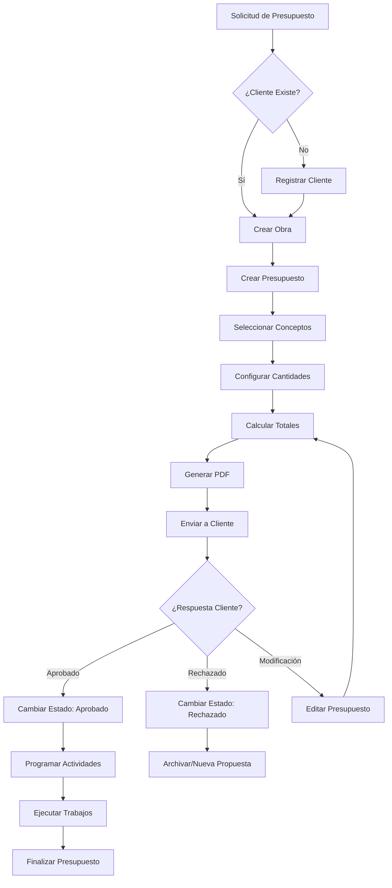
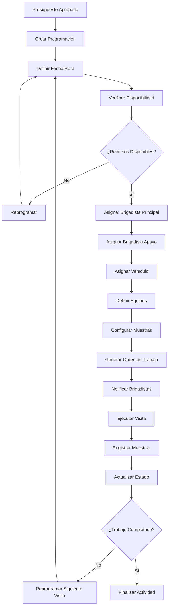
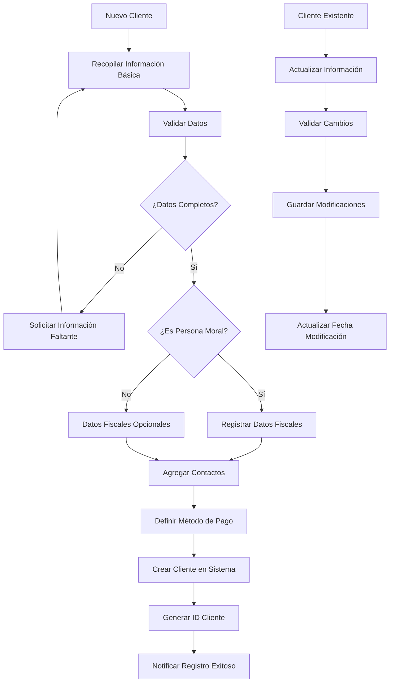
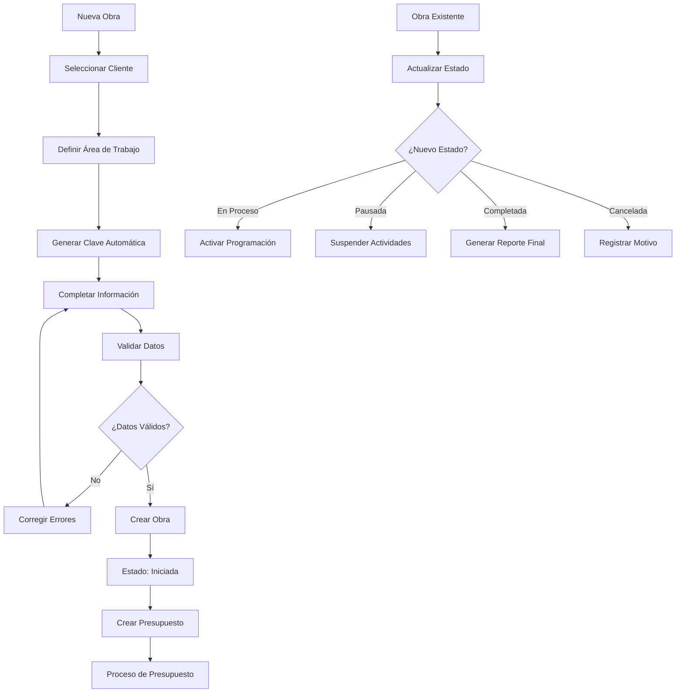
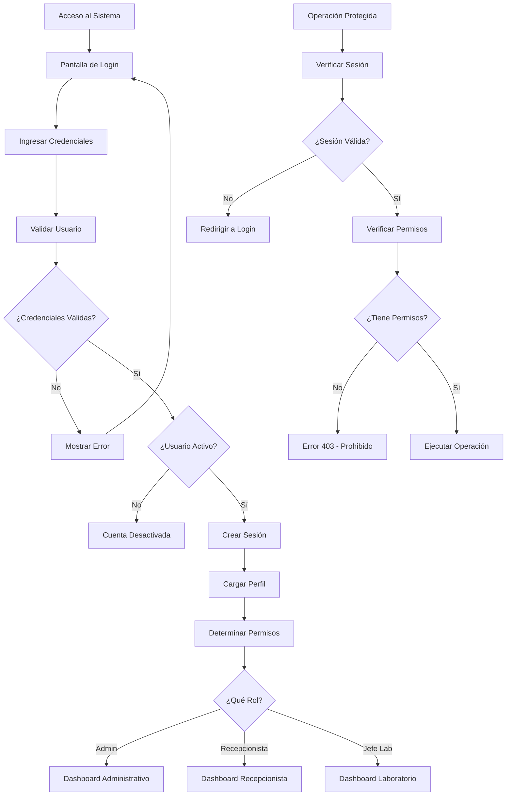
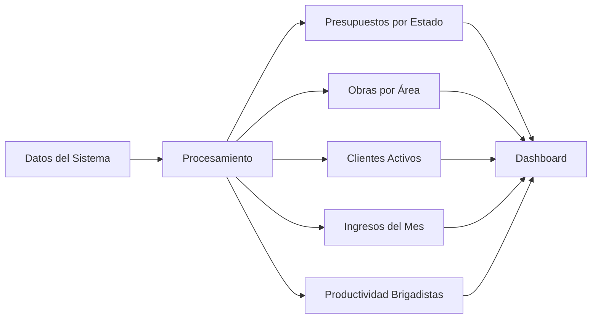

# 🔄 Flujos de Usuario - LaboratorioLao

## 📋 Información General

Este documento describe los flujos de trabajo principales del sistema LaboratorioLao, organizados por rol de usuario y proceso de negocio. Cada flujo incluye diagramas, pasos detallados y casos de uso.

---

## 👥 Roles del Sistema

### 🔐 **Administrador**
- Acceso total al sistema
- Gestión de usuarios y configuración
- Visualización de todos los presupuestos
- Configuración del sistema jerárquico

### 👩‍💼 **Recepcionista**
- Gestión de clientes
- Creación y seguimiento de presupuestos
- Generación de documentos
- Solo visualiza sus propios presupuestos

### 👨‍🔬 **Jefe de Laboratorio**
- Gestión de programación
- Asignación de recursos (brigadistas, vehículos)
- Seguimiento de actividades de campo
- Reportes de productividad

---

## 💰 Flujo Principal: Gestión de Presupuestos

### 🎯 Objetivo
Crear, gestionar y dar seguimiento a presupuestos desde la solicitud inicial hasta la finalización del proyecto.

### 📊 Diagrama de Flujo



### 📝 Pasos Detallados

#### **Fase 1: Preparación**
1. **Recepción de Solicitud**
   - Cliente contacta al laboratorio
   - Recepcionista recopila información inicial
   - Se define alcance preliminar

2. **Verificación de Cliente**
   - Buscar cliente en sistema
   - Si no existe: registrar nuevo cliente
   - Completar datos de facturación si es necesario

3. **Registro de Obra**
   - Crear nueva obra en el sistema
   - Generar clave automática (ej: CC-2024-0001)
   - Asignar área correspondiente
   - Definir responsables y contactos

#### **Fase 2: Elaboración del Presupuesto**
4. **Crear Presupuesto**
   - Vincular a obra y cliente
   - Establecer usuario creador
   - Estado inicial: "borrador"

5. **Seleccionar Conceptos**
   - Navegar estructura jerárquica
   - Seleccionar servicios requeridos
   - Verificar precios unitarios actuales

6. **Configurar Cantidades**
   - Definir cantidad por concepto
   - Especificar unidades de medida
   - Validar coherencia técnica

7. **Cálculos Automáticos**
   - Sistema calcula subtotales
   - Aplica IVA configurado (16%)
   - Genera total final
   - Calcula anticipo si aplica

#### **Fase 3: Presentación al Cliente**
8. **Generar Documentos**
   - Crear PDF con formato oficial
   - Incluir términos y condiciones
   - Anexar información técnica
   - Aplicar logotipo y membrete

9. **Envío al Cliente**
   - Cambiar estado a "enviado"
   - Registrar fecha de envío
   - Establecer seguimiento

#### **Fase 4: Gestión de Respuesta**
10. **Seguimiento**
    - Contactar cliente para confirmación
    - Registrar observaciones
    - Gestionar modificaciones si es necesario

11. **Respuesta del Cliente**
    - **Aprobado**: Proceder a programación
    - **Rechazado**: Registrar motivo y archivar
    - **Modificaciones**: Editar presupuesto y recotizar

---

## 📅 Flujo de Programación de Actividades

### 🎯 Objetivo
Programar y ejecutar las actividades de laboratorio una vez aprobado el presupuesto.

### 📊 Diagrama de Flujo



### 📝 Pasos Detallados

#### **Fase 1: Planeación**
1. **Iniciar Programación**
   - Seleccionar presupuesto aprobado
   - Verificar conceptos a ejecutar
   - Revisar condiciones especiales

2. **Programar Fecha y Hora**
   - Coordinar con cliente/residente
   - Verificar calendario de actividades
   - Considerar condiciones climáticas

3. **Verificar Recursos**
   - Consultar disponibilidad de brigadistas
   - Verificar vehículos disponibles
   - Confirmar equipos necesarios

#### **Fase 2: Asignación de Recursos**
4. **Asignar Brigadista Principal**
   - Seleccionar según experiencia
   - Verificar certificaciones necesarias
   - Confirmar disponibilidad

5. **Asignar Brigadista de Apoyo** (opcional)
   - Para trabajos que requieren 2+ personas
   - Balancear cargas de trabajo
   - Considerar ubicación geográfica

6. **Asignar Vehículo**
   - Según capacidad requerida
   - Verificar estado y mantenimiento
   - Considerar ruta y distancia

#### **Fase 3: Configuración Técnica**
7. **Definir Equipos y Herramientas**
   - Listar equipos necesarios
   - Verificar calibración
   - Preparar herramientas especiales

8. **Configurar Plan de Muestreo**
   - Definir cantidad de muestras
   - Especificar distribución
   - Establecer criterios de recolección

#### **Fase 4: Ejecución**
9. **Preparar Orden de Trabajo**
   - Generar documento con instrucciones
   - Incluir datos de contacto
   - Especificar procedimientos

10. **Ejecutar Visita**
    - Brigadistas se presentan en obra
    - Coordinan con residente
    - Ejecutan muestreo según plan

11. **Registrar Resultados**
    - Actualizar sistema con muestras obtenidas
    - Registrar observaciones
    - Documentar incidencias

---

## 👤 Flujo de Gestión de Clientes

### 🎯 Objetivo
Mantener una base de datos actualizada de clientes con toda la información necesaria para facturación y contacto.

### 📊 Diagrama de Flujo



### 📝 Pasos Detallados

#### **Registro de Nuevo Cliente**
1. **Información Básica**
   - Nombre o razón social
   - Dirección fiscal
   - Teléfono principal
   - Correo electrónico

2. **Datos Fiscales** (si aplica)
   - RFC
   - Régimen fiscal
   - Uso de CFDI
   - Tipo de pago (PUE/PPD)

3. **Contactos Adicionales**
   - Múltiples teléfonos
   - Múltiples correos
   - Contacto para pagos
   - Representante legal

4. **Configuración**
   - Método de pago preferido
   - Condiciones especiales
   - Historial de crédito

---

## 🏗️ Flujo de Gestión de Obras

### 🎯 Objetivo
Registrar y dar seguimiento a las obras desde su inicio hasta su conclusión.

### 📊 Diagrama de Flujo



### 📝 Pasos Detallados

#### **Creación de Obra**
1. **Información Básica**
   - Seleccionar cliente existente
   - Definir nombre del proyecto
   - Describir alcance y objetivos

2. **Clasificación**
   - Seleccionar área (CC, GEO, etc.)
   - Sistema genera clave automática
   - Formato: AREA-AÑO-NUMERO

3. **Detalles del Proyecto**
   - Ubicación física
   - Empresa contratista
   - Responsable de obra
   - Fechas estimadas

4. **Seguimiento**
   - Estado inicial: "Iniciada"
   - Asignación de responsables internos
   - Configuración de notificaciones

---

## 🔐 Flujo de Autenticación y Seguridad

### 🎯 Objetivo
Garantizar acceso seguro al sistema con permisos apropiados según el rol del usuario.

### 📊 Diagrama de Flujo



### 📝 Control de Permisos por Rol

#### **Administrador**
- ✅ Crear, leer, actualizar, eliminar todos los registros
- ✅ Gestionar usuarios y roles
- ✅ Configurar sistema jerárquico
- ✅ Acceder a todos los presupuestos
- ✅ Generar reportes del sistema

#### **Recepcionista**
- ✅ Gestionar clientes (CRUD completo)
- ✅ Crear y editar presupuestos propios
- ✅ Ver solo presupuestos propios
- ✅ Generar PDF de presupuestos
- ❌ Acceder a presupuestos de otros usuarios
- ❌ Gestionar usuarios
- ❌ Modificar configuración del sistema

#### **Jefe de Laboratorio**
- ✅ Gestionar programación (CRUD completo)
- ✅ Asignar brigadistas y vehículos
- ✅ Ver programaciones y reportes
- ✅ Gestionar recursos (brigadistas, vehículos)
- ❌ Crear presupuestos
- ❌ Gestionar clientes
- ❌ Acceder a configuración administrativa

---

## 📊 Flujos de Reportes y Analytics

### 🎯 Objetivo
Generar información estratégica para la toma de decisiones basada en datos del sistema.

### 📊 Tipos de Reportes

#### **Dashboard Ejecutivo**


#### **Reportes Disponibles**
1. **Estadísticas Generales**
   - Total de clientes
   - Presupuestos por estado
   - Obras activas
   - Ingresos mensuales

2. **Reportes de Productividad**
   - Actividades por brigadista
   - Utilización de vehículos
   - Tiempo promedio por proyecto
   - Eficiencia por área

3. **Reportes Financieros**
   - Ingresos por cliente
   - Proyección de ingresos
   - Análisis de rentabilidad
   - Seguimiento de pagos

---

## 🚨 Flujos de Excepción y Errores

### 📋 Manejo de Situaciones Especiales

#### **Presupuesto Rechazado**
1. Cliente notifica rechazo
2. Registrar motivo en sistema
3. Cambiar estado a "rechazado"
4. Evaluar posibilidad de nueva propuesta
5. Archivar o crear nuevo presupuesto

#### **Programación Cancelada**
1. Cliente/circunstancias cancelan visita
2. Notificar a brigadistas
3. Liberar recursos asignados
4. Reprogramar nueva fecha
5. Actualizar estado en sistema

#### **Cliente Inactivo**
1. Detectar falta de actividad
2. Intentar contacto
3. Marcar como inactivo si no responde
4. Mantener historial para reactivación

#### **Error en Muestreo**
1. Brigadista reporta problema
2. Evaluar impacto en cronograma
3. Reprogramar muestreo adicional
4. Notificar a cliente si es necesario
5. Documentar lección aprendida

---

## 📱 Flujos de Interfaz de Usuario

### 🎨 Navegación Principal

#### **Estructura de Menús**
```
Dashboard Principal
├── Presupuestos
│   ├── Lista de Presupuestos
│   ├── Crear Nuevo
│   └── Búsqueda Avanzada
├── Clientes
│   ├── Lista de Clientes
│   ├── Registro de Cliente
│   └── Datos Fiscales
├── Obras
│   ├── Lista de Obras
│   ├── Nueva Obra
│   └── Seguimiento
├── Programación
│   ├── Calendario
│   ├── Nueva Programación
│   ├── Brigadistas
│   └── Vehículos
└── Administración
    ├── Sistema Jerárquico
    ├── Usuarios
    └── Configuración
```

### 🔄 Flujo de Navegación Típico

#### **Crear Presupuesto Completo**
1. Dashboard → Presupuestos → Crear Nuevo
2. Seleccionar/Crear Cliente
3. Seleccionar/Crear Obra
4. Elegir Conceptos del Catálogo
5. Configurar Cantidades y Precios
6. Revisar Cálculos
7. Generar Vista Previa
8. Guardar y Generar PDF
9. Cambiar Estado a "Enviado"

#### **Programar Actividad**
1. Dashboard → Programación → Nueva Programación
2. Seleccionar Presupuesto Aprobado
3. Definir Fecha y Hora
4. Asignar Brigadista Principal
5. Asignar Vehículo
6. Configurar Detalles de Muestreo
7. Generar Orden de Trabajo
8. Confirmar Programación

---

## 📈 Métricas y KPIs

### 📊 Indicadores Clave de Rendimiento

#### **Eficiencia Operativa**
- Tiempo promedio de creación de presupuesto
- Porcentaje de aprobación de presupuestos
- Tiempo promedio de ejecución de trabajos
- Utilización de recursos (brigadistas, vehículos)

#### **Satisfacción del Cliente**
- Tiempo de respuesta a solicitudes
- Precisión en entregas programadas
- Número de reprogramaciones
- Feedback de clientes

#### **Rendimiento Financiero**
- Ingresos mensuales por área
- Rentabilidad por tipo de proyecto
- Cuentas por cobrar
- Conversión de presupuestos a obras

---

*Documentación de flujos de usuario generada para LaboratorioLao v1.0.0*